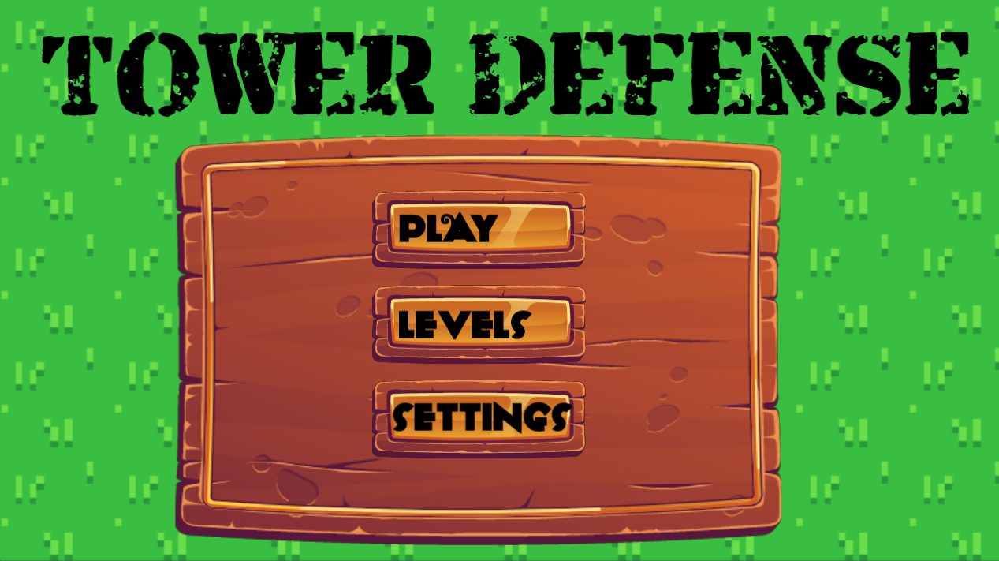

TowerDefense.cpp
===============
A small Tower Defense made written in C++

Description
------------

This game is a Tower Defense written in  C++20 , who you have to defend your base from multiple wave of enemies.To help you you will have to spend your coins into 3 type of turrets to help you and fight 3 types of enemies.

### Enemies
Wealking: Fast , Huge damage to player, low life.
Heaby : Slow , Lot of Health , gice more coins.
Healer : Normal speed , Normal Health , Heal enemys nearby him.

### Tower
- Classical : Normal damage , low cost , normal range .
- IceTower : beam that deal more damage and growth with time , and slow enemys.
- Explosive turret : Deal a lot of damage , Slow fire rate , huge cost.

What we learn 
------------

- We learn is this project how useful is class in c++ In on vector of Enemys we can store our of type of enemies and have different function in them using override and virtual.
 - We learn how to animate our sprite.

Asset Credits
-------------
- Sprites Slowing : https://creativekind.itch.io/obelisk
- Font : https://www.dafont.com/fr/3x5.font
- Heavy : https://creativekind.itch.io/nightborne-warrior
- Explosive : https://creativekind.itch.io/gif-bloodmoon-tower-free
- End game : https://www.freepik.com/free-vector/game-ui-interface-boards-with-win-lose_21267383.htm
- Menu UI : https://www.freepik.com/free-vector/wooden-gold-buttons-ui-game_12760665.htm
